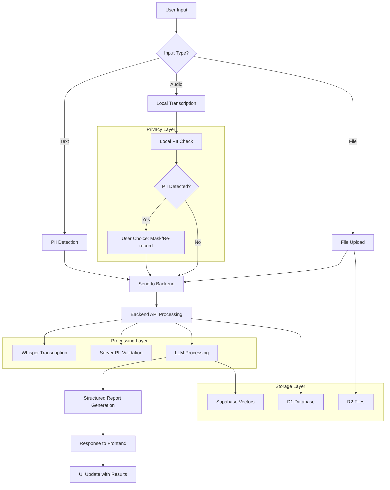

# Radiology Assistant - Low-Level Design (LLD)

## 🏗️ System Architecture Overview

```
┌─────────────────────────────────────────────────────────────────────────────┐
│                           EDGE LAYER (Cloudflare)                          │
├─────────────────────────────────────────────────────────────────────────────┤
│  Frontend (Static Assets) │ Backend API (Hono) │ Data Layer (D1/R2)        │
│  - HTML/CSS/JS            │ - REST Endpoints   │ - SQLite (D1)             │
│  - Privacy-first PII      │ - Audio Processing │ - File Storage (R2)       │
│  - Local Transcription    │ - LLM Integration  │ - Vector DB (Supabase)    │
└─────────────────────────────────────────────────────────────────────────────┘
                                      │
                                      ▼
┌─────────────────────────────────────────────────────────────────────────────┐
│                         EXTERNAL SERVICES LAYER                            │
├─────────────────────────────────────────────────────────────────────────────┤
│  OpenAI Services          │ Supabase Services │ Stripe Services             │
│  - GPT-4o (LLM)          │ - PostgreSQL      │ - Payments                  │
│  - Whisper (STT)         │ - Vector Search   │ - Subscriptions             │
│  - Embeddings API        │ - Authentication  │ - Usage Tracking            │
└─────────────────────────────────────────────────────────────────────────────┘
```

## 🔄 Component Interaction Flow

### 1. **Frontend Components** (`/public/static/app.js`)

```javascript
RadiologyAssistant Class Structure:
├── User Interface Management
│   ├── renderInterface() - Main UI rendering
│   ├── renderTemplates() - Template selection UI
│   └── displayMessages() - Chat message display
├── Audio Processing Pipeline
│   ├── startRecording() → MediaRecorder API
│   ├── startSpeechRecognition() → Local transcription
│   ├── detectPIILocally() → Privacy-first PII detection
│   └── displayRecordingResults() → Results in chat UI
├── Message Management
│   ├── sendMessage() → API calls with audio/text
│   ├── handleMessageResponse() → Process API responses
│   └── loadChat()/loadChats() → Chat history management
└── File & Template Management
    ├── handleFileUpload() → File processing
    ├── loadTemplates() → Available report templates
    └── selectTemplate() → Template selection logic
```

### 2. **Backend API Components** (`/src/index.tsx`)

```typescript
Hono Application Structure:
├── Core Routes
│   ├── GET / → Main application HTML
│   ├── GET /api/health → Service health check
│   └── Static file serving (/static/*)
├── Chat Management
│   ├── GET /api/chats → List user chats
│   ├── POST /api/chats → Create new chat
│   ├── GET /api/chats/:id/messages → Chat history
│   └── POST /api/chats/:id/messages → Send new message
├── AI Processing Pipeline
│   ├── POST /api/transcribe → Audio transcription (Whisper)
│   ├── POST /api/pii/detect → PII detection & sanitization
│   └── LLM Processing → GPT-4o structured report generation
├── File & Knowledge Management
│   ├── POST /api/files/upload → File upload to R2
│   ├── GET /api/knowledge/search → RAG vector search
│   └── GET /api/templates → Report templates
└── Usage & Analytics
    ├── GET /api/usage/me → User usage statistics
    └── POST /api/usage/track → Usage tracking
```

### 3. **Data Flow Architecture**



## 🗄️ Database Schema & Relationships

### D1 Database (Primary Storage)
```sql
-- Core user and session management
users ├─ chats ├─ messages
      │        └─ chat_templates
      ├─ usage_tracking
      ├─ credit_balance
      └─ user_templates

-- File and knowledge management  
files ├─ file_chunks
      └─ document_metadata

-- Template system
templates ├─ template_versions
          └─ template_fields
```

### Supabase PostgreSQL (Vector Storage)
```sql
-- RAG and knowledge base
documents ├─ document_chunks (with embeddings)
          ├─ chunk_vectors (pgvector)
          └─ search_indexes
```

### R2 Object Storage
```
buckets/
├── uploads/{user_id}/{file_id} - User uploaded files
├── processed/{chat_id}/ - Processed documents
└── exports/{user_id}/ - Generated reports
```

## 🔧 Service Integration Points

### 1. **Authentication Flow**
```
Frontend → Supabase Auth → JWT Token → Backend Validation → User Context
```

### 2. **Audio Processing Pipeline**
```
Local Recording → Web Speech API → PII Detection → 
MediaRecorder Blob → Backend Upload → Whisper API → 
Enhanced Transcript → LLM Processing → Structured Report
```

### 3. **File Processing Workflow**
```
File Upload → R2 Storage → Text Extraction → 
Chunk Generation → Vector Embeddings → Supabase Storage → 
RAG Search Index → Knowledge Retrieval
```

### 4. **LLM Integration Pattern**
```
User Input → PII Sanitization → Template Selection → 
Context Preparation → OpenAI GPT-4o → Structured Output → 
JSON Validation → Markdown Rendering → Response Delivery
```

## 🚦 Error Handling & Resilience

### Circuit Breaker Pattern
```typescript
Service Clients with Graceful Fallbacks:
├── OpenAI → Fallback to local processing
├── Supabase → Fallback to D1-only mode  
├── Stripe → Fallback to usage tracking only
└── External APIs → Timeout and retry logic
```

### Privacy-First Error Recovery
```typescript
PII Detection Failures:
├── Client-side detection continues
├── Server validation as backup
├── No data sent until cleared
└── User maintains control
```

## 📊 Performance Characteristics

### Latency Targets
- **Frontend Rendering**: <100ms (local DOM updates)
- **PII Detection**: <50ms (local processing)
- **API Responses**: <500ms (D1 queries)
- **Audio Transcription**: 2-5s (Whisper API)
- **LLM Generation**: 3-10s (GPT-4o complexity)
- **File Upload**: <30s (R2 direct upload)

### Scalability Design
- **Horizontal**: Cloudflare Pages auto-scales globally
- **Database**: D1 read replicas + connection pooling
- **Storage**: R2 unlimited with CDN distribution  
- **AI Processing**: OpenAI handles scaling automatically

## 🔒 Security Architecture

### Data Privacy Layers
```
Layer 1: Local PII Detection (Client-side)
Layer 2: Server PII Validation (API Gateway)  
Layer 3: Encryption at Rest (D1/R2/Supabase)
Layer 4: Transport Security (TLS 1.3)
Layer 5: Access Controls (JWT + Supabase Auth)
```

### UK Healthcare Compliance
- **NHS Numbers**: Pattern detection and masking
- **Postcodes**: Geographic PII identification  
- **NI Numbers**: National Insurance anonymization
- **Personal Data**: GDPR-compliant processing
- **Audio Privacy**: Local processing before cloud

## 🔄 State Management

### Frontend State
```javascript
RadiologyAssistant State:
├── currentChatId - Active conversation
├── selectedTemplate - Report type selection
├── isRecording - Audio capture state
├── localTranscript - Privacy-safe transcription
├── piiDetected - User consent required
└── uploadedFiles - Attachment management
```

### Backend Session State
```typescript
Request Context (Hono):
├── User Authentication (JWT)
├── Service Clients (OpenAI, Supabase, Stripe)
├── Database Connections (D1, Supabase)
├── Usage Tracking (Credits, Tokens)
└── Error States (Graceful Fallbacks)
```

## 🌐 API Contract Specifications

### Core Endpoints
```typescript
// Health & Status
GET /api/health → ServiceHealth

// Chat Management  
GET /api/chats → Chat[]
POST /api/chats → ChatCreated
GET /api/chats/:id/messages → Message[]
POST /api/chats/:id/messages → MessageResponse

// Privacy & Processing
POST /api/pii/detect → PIIDetectionResult
POST /api/transcribe → TranscriptionResult

// File & Knowledge
POST /api/files/upload → FileUploadResult
GET /api/knowledge/search → SearchResults

// Templates & Usage
GET /api/templates → Template[]  
GET /api/usage/me → UsageStatistics
```

### Data Models
```typescript
interface Message {
  id: number;
  chat_id: number;
  role: 'user' | 'assistant';
  text?: string;
  transcript_text?: string; // Local + Whisper combined
  attachments_json?: string;
  json_output?: string; // Structured LLM output
  rendered_md?: string; // Formatted markdown
  usage_stats?: UsageStats;
  created_at: string;
}

interface PIIDetectionResult {
  detected: boolean;
  types: string[];
  originalText: string;
  cleanedText: string;
  confidence: number;
}

interface TranscriptionResult {
  transcript: string;
  confidence: number;
  duration: number;
  language: string;
}
```

This LLD provides the complete technical foundation. Now let me build the multi-agent debugging system and fix your UI issue.